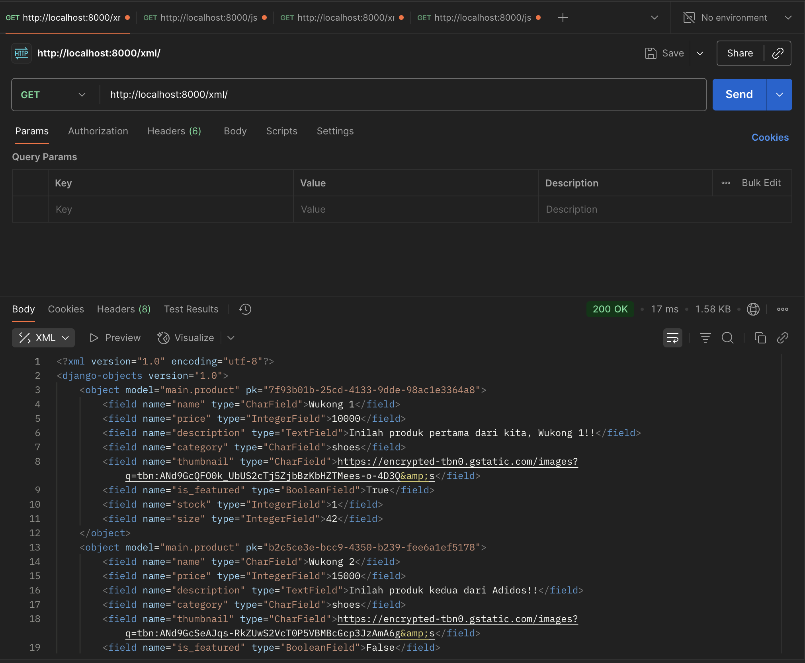
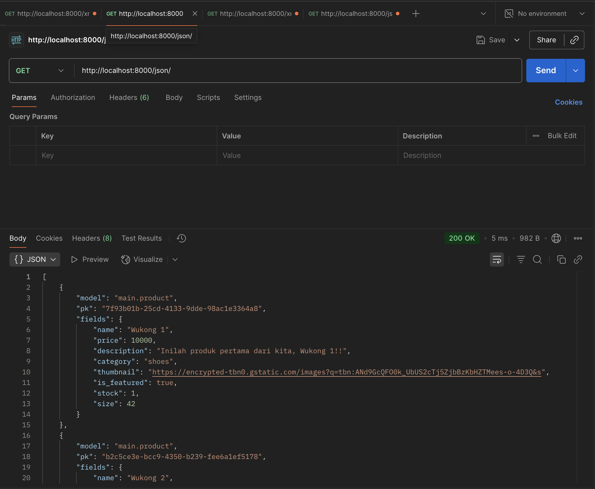
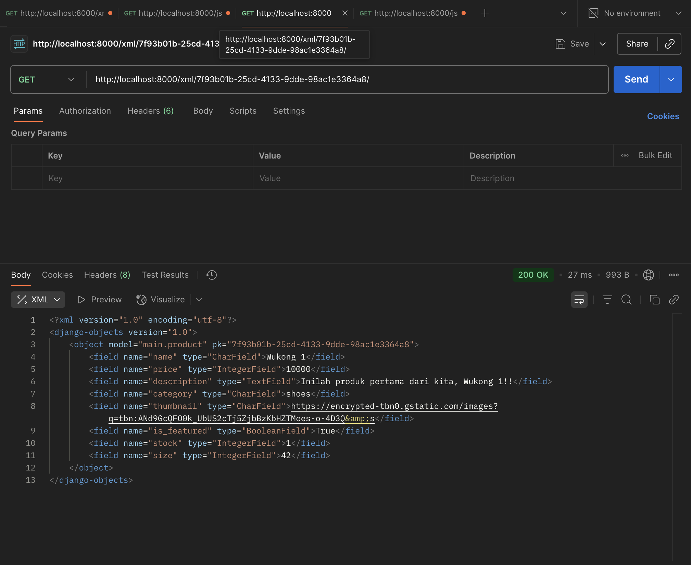
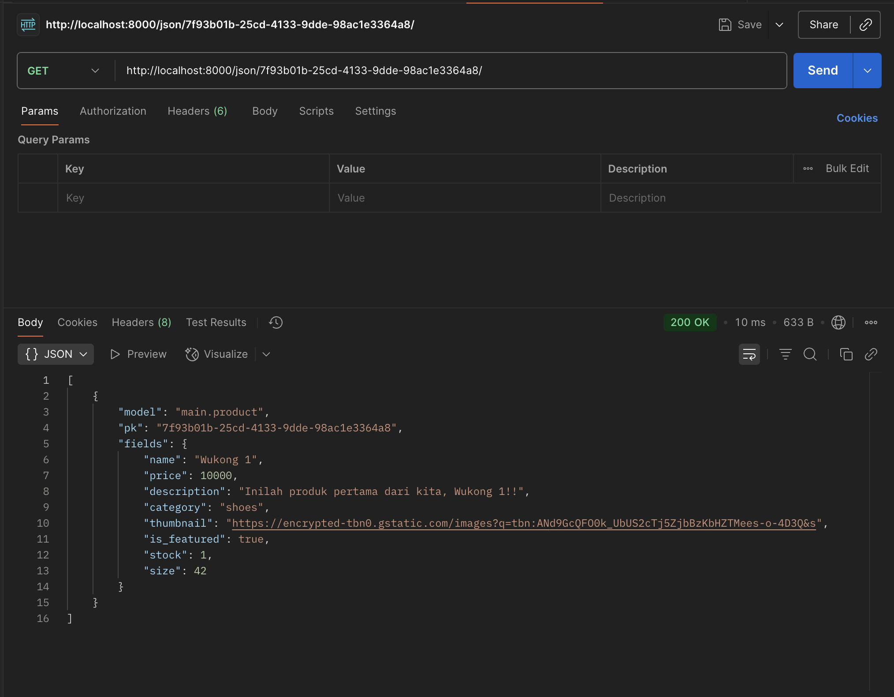

# Adidos — Tugas 3

**Tautan Aplikasi PWS:** 
https://galih-nur41-adidos.pbp.cs.ui.ac.id

---

## 1) Step-by-step yang saya lakukan

1. **Implementasi skeleton sebagai kerangka views**

   * Membuat direktori templates pada direktori utama, lalu membuat base.html nya
   * Update file settings.py pada direktori project, di variable TEMPLATES, ganti menjadi
   `'DIRS': [BASE_DIR / 'templates']`
   * Update main.html di direktori main

2. **Membuat Form Input dan menampilkan data pada HTML**

   * Membuat `forms.py` di direktori main untuk membuat struktor form yang dapat menerima 
   data produk baru
   * Update bagian `views.py` di direktori main dengan menambahkan fungsi `create_product` dan 
   `show_product`, dan menambahkan beberapa import yang diperlukan
   * Update `urls.py` dengan menambahkan beberapa import yang diperlukan dan path URL
   * Update `main.html` di direktori `main/templates` sehingga dapat menampilkan data produk dan 
   tombol "Add Product"
   * Buat berkas `create_product.html` untuk tampilan saat ingin add product dan `product_detail`
   untuk tampilan detail saat kita klik tombol detail pada produk

3. **Menambah 4 fungsi pada Views**

   * Update berkas `views.py` pada direktori main, dengan menambah import yang diperlukan
   * Menambah keempat fungsi pada views sehingga dapat melihat object dalam format XML dan JSON,
   1 object XML atau JSON dari id tertentu. Yaitu, dengan membuat variable untuk menyimpan
   hasil query dari seluruh data pada Product, lalu mengserialize untuk mentranslate, lalu 
   mereturn function berupa `HttpResponse`, khusus XML by Id dan JSON by Id, gunakan try-except
   * Update `urls.py` dengan mengimport keempat fungsi yang kita buat tadi
   * Tambahkan path url ke dalam `urlpatterns`

4. **Push ke Github dan PWS**

   * Add, commit, push ke github
   * Push ke PWS

---

## 2) Mengapa kita memerlukan data delivery dalam pengimplementasian sebuah platform?

Kita memerlukan data delivery untuk mengimplementasikan sebuah platform karena memungkinkan data disalurkan secara efisien, akurat, dan tepat waktu ke berbagai aplikasi atau pengguna, sehingga 
pengguna selalu mendapatkan experience yang akurat dan real time.

---

## 3) Menurutmu, mana yang lebih baik antara XML dan JSON? Mengapa JSON lebih populer dibandingkan XML?

Menurut saya, JSON lebih baik dibandingkan XML, karena formatnya lebih mudah dimengerti. Alasan
mengapa JSON lebih populer dibandingkan XML mungkin karena JSON adalah format text, sehingga banyak
bahasa pemrograman yang memiliki dukungan untuk membaca dan membuat JSON, dan juga orang-orang
pemula lebih mudah mempelajari JSON dibandingkan XML.

---

## 4) Jelaskan fungsi dari method `is_valid()` pada form Django dan mengapa kita membutuhkan method tersebut?

Metode `is_valid()` dalam formulir Django berfungsi untuk memvalidasi seluruh data yang dimasukkan pengguna ke dalam formulir dan mengembalikan `True` jika semua data sesuai dengan aturan validasi yang ditentukan, atau `False` jika ada data yang tidak valid. Kita membutuhkan metode ini untuk memastikan keamanan dan integritas data aplikasi, karena validasi memastikan data yang dikonversi ke tipe data Python telah bersih dan sesuai standar sebelum disimpan di basis data.

---

## 5) Mengapa kita membutuhkan `csrf_token` saat membuat form di Django? Apa yang dapat terjadi jika kita tidak menambahkan `csrf_token` pada form Django? Bagaimana hal tersebut dapat dimanfaatkan oleh penyerang?

Kita membutuhkan `csrf_token` agar dapat memastikan setiap request berasal dari user yang sah sehingga
terlindungi dari serangan Cross-Site Request Forgery. Jika kita tidak menambahkan `csrf_token` pada form,
aplikasi menjadi rentan karena request yang berbahaya dari situs lain bisa diproses tanpa verifikasi
keaslian. Hal ini dapat dimanfaatkan oleh penyerang, karena mereka dapat membuat user tanpa sadar melakukan sesuatu yang berbahaya (misalnya transfer uang) melalui request palsu yang tampak sah.

---

## 6) Feedback singkat untuk asisten dosen (Tutorial 2)

* Asisten dosen membantu saya menyelesaikan masalah yang terjadi saat lab.

---

## POSTMAN

* /xml

* /json

* /xml/id

* /json/id
